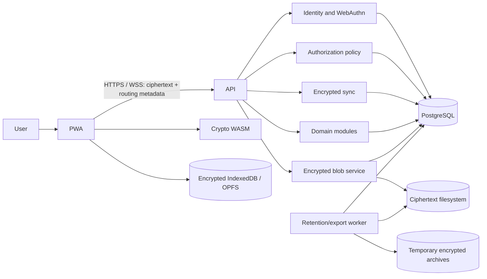

# Architecture

## Status and goals

Sprout is a pre-production, end-to-end encrypted task platform. Its primary client is a React/TypeScript PWA; shared cryptographic code is written in Rust and compiled to WebAssembly. The server is a Rust/Axum modular monolith with PostgreSQL for routing metadata and events and a Linux filesystem for encrypted blobs.

The design aims to:

- keep semantic content confidential from the service;
- enforce project isolation and recursive authorization at both application and database boundaries;
- support offline work with deterministic, retry-safe convergence;
- make retention, export, recovery, and release decisions auditable.

This architecture does not make a browser-delivered PWA a trusted distribution channel. A compromised origin can serve malicious JavaScript that steals plaintext or keys while they are in memory. CSP, Trusted Types, no third-party scripts, signed immutable artifacts, reproducible builds, and separate static hosting reduce risk but do not remove it.

## System context

## Component boundaries

| Component | Responsibility | Must not do |
| --- | --- | --- |
| `frontend/sprout-web` | Passkeys, local decryption, filters, offline queue, conflict UI, export download | Send sensitive plaintext, keys, or local paths to the service |
| `crates/crypto-wasm` | Minimal browser binding to the shared protocol | Log secrets or define a second protocol |
| `apps/server` | API/worker startup, configuration, health, graceful shutdown | Decrypt content |
| `crates/api-contract` | Versioned ciphertext/routing DTOs and TypeScript contract generation | Carry semantic plaintext |
| `crates/application` | Use cases, authorization, transactions | Depend on HTTP or SQL details |
| `crates/domain` | Domain state machines and invariants | Perform storage or transport work |
| `crates/storage-postgres` | SQLx repositories, transactions, RLS, migrations | Bypass project scoping |
| `crates/crypto-protocol` | Versioned formats, canonical AAD, envelopes, signatures, suite adapters | Expose unauthenticated or unversioned formats |
| `crates/test-support` | Virtual clock/authenticator, temporary PostgreSQL/filesystem harnesses | Enter production artifacts |

API and worker are separate processes when operational isolation or scaling requires it, but they use the same application and domain modules. See [ADR-0001](adr/0001-modular-monolith.md).

## Data and trust boundaries

The client/server boundary is the encrypted-payload boundary described in [ADR-0002](adr/0002-encrypted-payload-boundary.md). The service may process identity, routing, authorization, operational timestamps, versions, ciphertext lengths, and synchronization metadata. It must not receive names, descriptions, questionnaire text or answers, filenames, logical client paths, or content keys in plaintext.

All project-owned rows use a composite project reference. Application authorization and PostgreSQL RLS are independent controls. Historical data is removed only by controlled purge jobs, not broad cascade deletion.

The server remains trusted for availability, authorization decisions, retention execution, and delivery of the web client. It is not trusted with content confidentiality. An active malicious server can still withhold/reorder data, substitute the PWA, infer metadata, or deny service; signed event chains and key transparency are intended to expose some of those actions, not prevent every denial.

## Core flows

### Write and synchronize

1. The client validates a domain command and constructs a versioned payload.
2. Rust/WASM encrypts it with a fresh DEK, unique nonce, canonical AAD, and the current resource-key epoch.
3. The client signs and queues a device-chained event with `base_version` and an idempotency key.
4. The API authenticates the device, authorizes metadata-visible resource scope, and atomically stores the event, snapshot, permission effects, and outbox record.
5. Other clients receive only a WebSocket hint, then fetch authoritative changes by cursor.
6. A stale base version becomes an explicit client-resolved conflict; the server never merges plaintext.

### Authorization and key delivery

An ancestor grant exposes the subtree. A descendant grant exposes only minimum ancestor headers under `container_only`, never siblings. Permission records preserve their origin so revoking one source cannot erase another valid source. Cryptographic access follows effective authorization using independent per-resource key epochs and per-device envelopes. See [ADR-0003](adr/0003-recursive-permissions.md).

### Recovery

The owner can re-enable other participants' devices. Owner recovery uses a secret shared among all active non-owner participants frozen at a membership epoch; every share is required. This `n-of-n` rule prevents unilateral recovery but creates a deliberate availability risk: one unavailable participant, or an owner-only project, makes recovery impossible. See [ADR-0004](adr/0004-per-resource-keys-recovery-unanimity.md).

## Deployment view

Production is intended for Linux under systemd:

- API and worker run as non-privileged, separately restartable services;
- PostgreSQL, ciphertext blobs, and archive manifests are backed up as one consistency set;
- readiness confirms dependencies and migration compatibility; liveness reports process health;
- structured logs and metrics contain identifiers only when necessary and never sensitive plaintext;
- restore drills use the same PostgreSQL major version as the target.

Operational details and production gates are in [operations.md](operations.md). The protocol, threat assumptions, and data boundary are normative in [crypto-protocol.md](crypto-protocol.md), [threat-model.md](threat-model.md), and [data-classification.md](data-classification.md).
